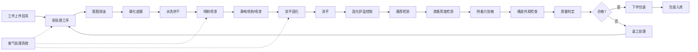

## 1. 产品概述

喷涂线工件涂装业务管理后台是面向涂装车间的专业生产管理系统，用于管理前处理、喷涂和固化全流程。系统覆盖上件挂具、前处理、喷粉喷漆、流平固化、膜厚检测、下件包装、废气处理七大核心模块，实现涂装生产全流程数字化管控。

- **核心目标**：提升涂装车间生产效率、质量可追溯性和环保合规性
- **目标用户**：车间管理人员、质量检测人员、设备运维人员、生产调度员
- **产品价值**：通过数据化管理降低返工率、优化工艺参数、保障环保达标

## 2. 核心功能

### 2.1 用户角色

| 角色 | 登录方式 | 核心权限 |
|------|----------|----------|
| 车间管理员 | 账号密码登录 | 全部模块查看与管理、数据统计、参数配置 |
| 质检员 | 账号密码登录 | 膜厚检测、附着力检测、外观检查数据录入与查询 |
| 操作员 | 账号密码登录 | 生产数据录入、设备状态查看 |
| 环保员 | 账号密码登录 | 废气处理模块数据查看与报表导出 |

### 2.2 功能模块

1. **上件挂具模块**：工件上件登记、挂具管理、挂具状态监控
2. **前处理模块**：脱脂除油、磷化皮膜、水洗烘干工艺参数管理与记录
3. **喷粉喷漆模块**：静电喷粉参数、喷漆参数、膜厚控制
4. **流平固化模块**：固化炉温曲线、流平时间管控
5. **膜厚检测模块**：漆膜厚度检测、附着力划格、橘皮外观检查
6. **下件包装模块**：下件登记、质量判定、包装入库
7. **废气处理模块**：废气排放监测、处理设备运行状态、环保数据报表

### 2.3 页面详情

| 页面名称 | 模块名称 | 功能描述 |
|----------|----------|----------|
| 工作台首页 | 数据概览 | 生产进度概览、关键指标卡片、今日产量趋势图、设备状态总览、告警信息 |
| 上件挂具 | 上件管理 | 工件信息录入、挂具选择、上件数量统计、批次管理 |
| 前处理 | 脱脂除油 | 脱脂温度、时间、浓度参数设置与实时监控，工艺记录查询 |
| 前处理 | 磷化皮膜 | 磷化温度、时间、PH值参数管理，皮膜质量记录 |
| 前处理 | 水洗烘干 | 水洗次数、烘干温度、烘干时间参数管理 |
| 喷粉喷漆 | 静电喷粉 | 喷粉电压、电流、出粉量参数设置，喷枪状态监控 |
| 喷粉喷漆 | 喷漆膜厚 | 喷漆压力、流量、漆膜厚度目标值设置 |
| 流平固化 | 固化炉温曲线 | 炉温实时曲线、温度分区控制、温度历史曲线图表 |
| 流平固化 | 流平时间 | 流平时间设置、流平状态监控 |
| 膜厚检测 | 漆膜厚度检测 | 检测点数据录入、厚度统计、合格率分析 |
| 膜厚检测 | 附着力划格 | 划格等级评定、检测记录、附着力趋势图 |
| 膜厚检测 | 橘皮外观检查 | 外观等级评定、缺陷记录、图片上传 |
| 下件包装 | 下件管理 | 下件数量统计、质量判定、批次完工确认 |
| 下件包装 | 包装入库 | 包装规格、入库数量、库存查询 |
| 废气处理 | 排放监测 | 废气浓度实时监测、排放达标情况、超标告警 |
| 废气处理 | 设备状态 | 处理设备运行状态、维护记录、耗材更换提醒 |

## 3. 核心流程

## 4. 用户界面设计

### 4.1 设计风格

- **主色调**：工业深蓝 (#0F2A4A) 搭配 活力橙 (#FF6B35)，体现工业科技感
- **辅助色**：成功绿 (#10B981)、警告黄 (#F59E0B)、危险红 (#EF4444)
- **背景**：深灰蓝渐变背景，营造专业工业氛围
- **卡片风格**：圆角卡片，轻微阴影，边框高亮状态指示
- **字体**：标题使用 Rajdhani 工业风字体，正文使用思源黑体
- **图标风格**：线性图标，配合状态色填充
- **按钮风格**：直角偏硬朗的工业风按钮，状态色填充

### 4.2 页面设计概览

| 页面名称 | 模块名称 | UI元素 |
|----------|----------|--------|
| 工作台 | 数据概览 | 顶部导航、侧边菜单、数据卡片网格、趋势折线图、设备状态列表、告警面板 |
| 上件挂具 | 上件管理 | 表单录入区、挂具状态卡片、批次列表、数量统计 |
| 前处理 | 工艺管理 | 参数配置面板、实时数据卡片、工艺曲线图表、历史记录表格 |
| 喷粉喷漆 | 喷涂管理 | 喷枪状态监控、参数调节面板、膜厚目标设置 |
| 流平固化 | 炉温曲线 | 实时温度曲线图、分区温度卡片、流平倒计时 |
| 膜厚检测 | 质量检测 | 检测数据录入表单、检测点示意图、合格率统计图表 |
| 下件包装 | 完工管理 | 下件统计表、质量判定面板、入库登记表单 |
| 废气处理 | 环保监测 | 实时监测仪表盘、排放趋势图、设备状态卡片 |

### 4.3 响应式设计

- **设计优先**：桌面端优先设计（1920px 宽度基准）
- **适配范围**：支持 1280px - 2560px 屏幕宽度
- **侧边栏**：可折叠侧边栏，适配小屏幕
- **数据表格**：支持横向滚动，保证数据完整性

### 4.4 数据可视化

- **图表类型**：折线图（温度曲线）、柱状图（产量统计）、仪表盘（实时监测值）、饼图（质量分布）
- **动画效果**：数据加载渐变动画、数值变化缓动效果、状态切换过渡动画
- **交互**：图表支持悬停查看详情、时间范围筛选、数据导出
