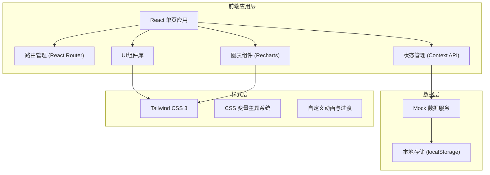

## 1. 架构设计



## 2. 技术描述

- **前端框架**: React@18 + TypeScript
- **构建工具**: Vite@5
- **样式方案**: Tailwind CSS@3
- **路由管理**: React Router DOM@6
- **图表库**: Recharts@2
- **图标库**: Lucide React
- **数据方案**: Mock 数据 + Context API 状态管理
- **字体**: Rajdhani (标题) + 思源黑体 (正文)

## 3. 路由定义

| 路由 | 页面 | 描述 |
|------|------|------|
| /dashboard | 工作台首页 | 生产数据概览、关键指标、告警信息 |
| /loading | 上件挂具 | 工件上件管理、挂具状态 |
| /pretreatment/degreasing | 前处理-脱脂除油 | 脱脂工艺参数与记录 |
| /pretreatment/phosphating | 前处理-磷化皮膜 | 磷化工艺参数与记录 |
| /pretreatment/drying | 前处理-水洗烘干 | 水洗烘干参数管理 |
| /spraying/powder | 喷粉喷漆-静电喷粉 | 喷粉参数与喷枪状态 |
| /spraying/paint | 喷粉喷漆-喷漆膜厚 | 喷漆参数与膜厚控制 |
| /curing/oven | 流平固化-固化炉温 | 炉温曲线与温度控制 |
| /curing/leveling | 流平固化-流平时间 | 流平参数与监控 |
| /inspection/thickness | 膜厚检测-漆膜厚度 | 厚度检测数据与统计 |
| /inspection/adhesion | 膜厚检测-附着力划格 | 附着力检测与评定 |
| /inspection/appearance | 膜厚检测-橘皮外观 | 外观检查与缺陷记录 |
| /unloading/unload | 下件包装-下件管理 | 下件登记与质量判定 |
| /unloading/packing | 下件包装-包装入库 | 包装入库管理 |
| /waste-gas/monitoring | 废气处理-排放监测 | 废气排放实时监测 |
| /waste-gas/equipment | 废气处理-设备状态 | 处理设备运行状态 |

## 4. 数据模型

### 4.1 核心数据结构

```typescript
// 工件批次
interface Batch {
  id: string;
  batchNo: string;
  workpieceName: string;
  workpieceType: string;
  quantity: number;
  hangerId: string;
  status: 'loading' | 'pretreatment' | 'spraying' | 'curing' | 'inspection' | 'finished' | 'rework';
  startTime: string;
  endTime?: string;
}

// 工艺参数
interface ProcessParams {
  temperature: number;
  time: number;
  concentration?: number;
  ph?: number;
  voltage?: number;
  current?: number;
  pressure?: number;
  flow?: number;
}

// 检测记录
interface InspectionRecord {
  id: string;
  batchId: string;
  type: 'thickness' | 'adhesion' | 'appearance';
  inspector: string;
  time: string;
  result: 'pass' | 'fail' | 'pending';
  data: Record<string, any>;
}

// 设备状态
interface Equipment {
  id: string;
  name: string;
  type: string;
  status: 'running' | 'stop' | 'fault' | 'maintenance';
  lastMaintenance: string;
  nextMaintenance?: string;
}

// 废气监测
interface WasteGasData {
  time: string;
  voc: number;
  dust: number;
  temperature: number;
  pressure: number;
}
```

### 4.2 模块数据定义

#### 上件挂具模块
- 工件信息：工件编号、名称、类型、数量
- 挂具信息：挂具编号、类型、承重、使用次数、状态
- 批次信息：批次号、上件时间、操作员、当前工序

#### 前处理模块
- 脱脂除油：温度(40-60℃)、时间(5-15min)、碱度、浓度
- 磷化皮膜：温度(30-50℃)、时间(3-10min)、PH值、膜重
- 水洗烘干：水洗次数、烘干温度(100-140℃)、烘干时间(10-30min)

#### 喷粉喷漆模块
- 静电喷粉：电压(60-90KV)、电流(10-30μA)、出粉量、喷枪数量
- 喷漆膜厚：喷漆压力、流量、目标膜厚(60-120μm)

#### 流平固化模块
- 固化炉温：多区温度曲线、保温时间、升温速率
- 流平时间：流平温度、流平时间(5-15min)

#### 膜厚检测模块
- 漆膜厚度：多点检测数据、平均值、最小值、最大值、合格率
- 附着力划格：划格等级(0-5级)、检测位置
- 橘皮外观：外观等级、缺陷类型、缺陷描述

#### 下件包装模块
- 下件数量、合格数量、不合格数量、返工数量
- 包装规格、包装数量、入库时间、库位

#### 废气处理模块
- VOC浓度、粉尘浓度、排放速率
- 设备运行状态、处理效率、耗材寿命

## 5. 组件架构

### 5.1 布局组件
- Layout: 主布局容器（侧边栏+顶部栏+内容区）
- Sidebar: 侧边导航菜单
- Header: 顶部导航栏
- PageContainer: 页面容器

### 5.2 通用组件
- StatCard: 数据统计卡片
- StatusBadge: 状态标签
- DataTable: 数据表格
- ChartCard: 图表卡片
- Modal: 弹窗组件
- FormItem: 表单项

### 5.3 业务组件
- TemperatureChart: 温度曲线图
- GaugeChart: 仪表盘组件
- ProcessTimeline: 工序进度条
- EquipmentCard: 设备状态卡片
- AlarmPanel: 告警面板

## 6. 项目目录结构

```
src/
├── components/          # 通用组件
│   ├── layout/         # 布局组件
│   ├── ui/             # 基础UI组件
│   └── charts/         # 图表组件
├── pages/              # 页面组件
│   ├── dashboard/      # 工作台
│   ├── loading/        # 上件挂具
│   ├── pretreatment/   # 前处理
│   ├── spraying/       # 喷粉喷漆
│   ├── curing/         # 流平固化
│   ├── inspection/     # 膜厚检测
│   ├── unloading/      # 下件包装
│   └── waste-gas/      # 废气处理
├── data/               # Mock数据
├── hooks/              # 自定义Hooks
├── context/            # Context状态管理
├── types/              # TypeScript类型定义
├── utils/              # 工具函数
├── styles/             # 全局样式
├── App.tsx
├── main.tsx
└── router.tsx
```
